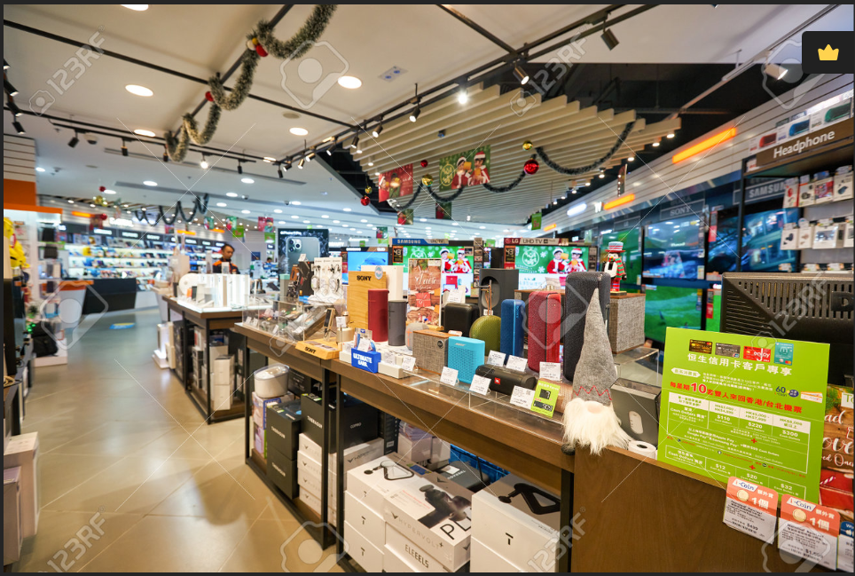

# E-commerce
---

---
## Introduction
---
This is a Tableau project on sales analysis of an imaginary store called **Super Stores**.
The project is to analyze and derive insights to answer crucial questions and help the store make data driven decisions.

**_Disclaimer_** : _All datasets and reports do not represent any company, institution or country, but just a dummy dataset to demonstrate capabilities of Tableau._

## Problem Statements
---
_KPI:_
1. Display a summary of total Sales and Profit for the current year and previous year.
   
_SALES TRENDS:_
1. Present the data for each **KPI** on a monthly basis for both the current and previous year.
2. Identify months with the highest and lowest sales and make them easy to recognize.
   
_PRODUCT SUB-CATEGORY COMPARISON:_
1. Compare Sales performance by different product for the current year and the previous year.
2. Compare the current year sales with current year profit.
3. Identify the 5 top prifitable states.
   
_WEEKLY TRENDS FOR SALES AND PROFIT:_
1. Present weekly sales and profit data for the current year.
2. Display the average weekly values.
3. Highlight weeks that are above and below the average to draw attention to sales and profit performance.

## Skills/ concepts demonstrated:
---
The following Tableau features were incorporated:
- Calculated Field
- Parameters
- Tooltip
- Path
- Label
- Filters
- Show me

## Modelling:
---

Tableau relationships define connections between tables- _Orders, People and Returns_ through specified key fields, facilitating integrated dataset creation for analysis. This model streamlines data blending, aggregation, and exploration while preserving integrity

## Visualization
---
This report comprises 6 pages:
- Sales KPI
- Profit KPI
- Sales Comparison
- Sales and Profit Comparison
- Weekly Trend
- Top 5 Profitable States

  You can interact with the report [here](https://public.tableau.com/app/profile/oluwole.fagbemi2492/viz/SS-SalesDashboard/Dashboard1?publish=yes)
  

  ## Analysis
  ---
  In the current year _2017_ the store made a sales of _609k_ compare to the previous year _2016_ which resulted into 29% in sales in the current year 2017.
  ## Sales KPI
  
  ---

  Comparing each year profit with previous year there was increase in the profitability of 24% in 2015, 33% in 2016 but 14% in 2017.
  ## Profit KPI
  

  In comparing the current year with the previous year _chairs and phones_ have been the most sold items and this has been consistent for three consecutive years.
  ## Sales Comparison
  

  While taking a critical look at all the sub-category Products in 2017 _Copier_ is giving the highest profit of 25k with 63k Sales.
  ## Comparing Current Sales with Current Profit
  

   The weekly average sales for three years have been very minimal from 2015=9k, 2016=11k, and 2017=14k while profit is 1k, 2k and 2k respectively.
  ## Sales and Profit weekly Trend
  

  In looking at our 5 top states with highest sales we discovered Carlifornia, New york and Washington.
  ## Top % Profitable States
  

  ## Conclusion and Recommendations:
  - California has the highest impact on income and copier has little invest with higher returns.
  - There is a need to review the sub-categories yielding loses, and what can be done to maximize profits.

  

   
